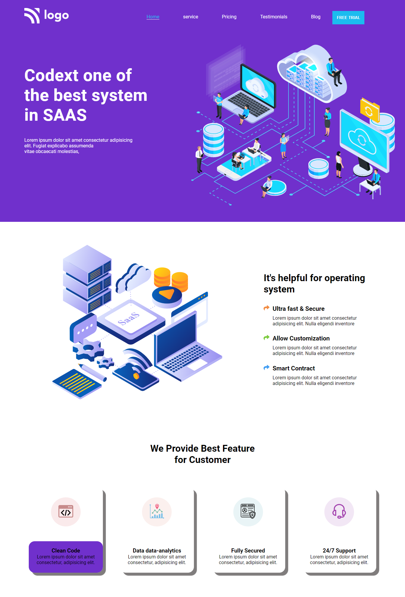

### SAAS web application  demo
----
A simple SAAS web application demo

  

### Things Learn from the project
- HTML   
     
- CSS  

### ScreenShot

*--------------------------------------------- Feel free to fork and play around ----------------------------------------*
